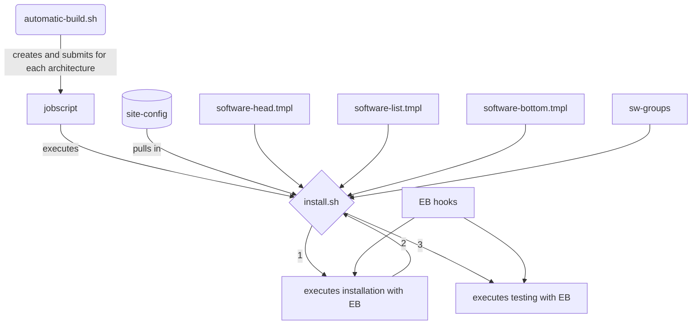

# Automatic software installation script

## Introduction:

The aim of the script is to install the software inside a container, and thus the so installed software is independent from the OS as much as possible, and also takes care of different architectures. The idea comes from the EESSI project and how the software is installed in there. So kudos to them!!

## How-to:

Before the script can run, there are a few files which need to be adjusted. 

- `site-config`
- `softwarelist.txt`
- `softwarelist.yaml`

The `site-config` file should contain all relevant paths for the software installation and that should be the only file which needs changes. That said, it might be worth to have a look at the other files to make sure nothing is accidentally hard-coded.

The `automatic-build.sh` script is expecting the full path there either the `software.txt` or `software.yaml` files are. One is enough, the scripts detect which ones are around and acts accordingly. This script is then then submitting the jobs, one for each to be build architecture as defined in the `site-config` file, to the queue. The submission script so generated is then calling the `install.sh` script. 

The `install.sh` does basically the whole magic. There are a few lines at the top which need to be changed to reflect where the software needs to go. It might be worth checking that but most of the relevant stuff is defined in the `site-config` file and are: 

- `SOFTWARE_INSTDIR` which is where the software tree and all the helper stuff lives
- `BINDDIR` is the directory which needs to be bound inside the container as per default Singularity does only mount `/tmp` and `/home` it seems.

You also might want to look at:

- `CONTAINER_VERSION` which is the name of the sif-file, i.e. the container
- `EB_VERSION` which is the version of EasyBuild to be used for building software. If that does not exist, it should be automatically installed
- `SW_LIST` contains a simple list of the EasyConfig files to be installed. All in one line with a blank between them. 
- `SW_YAML`contains the software to be installed as an EasyStack file in `yaml` format. 

Both the `SW_LIST` and the `SW_YAML` are independent from each other. So as long as the file got a content, it will be used. 

The `software.sh` will be created on the fly in the right directory, using the various template files, and  does contain the list of software which needs to be installed which will be pulled in by the `softwarelist.txt` file. The EasyStack file, so it exists, will be places in the correct directory. 
If you need to change any of the paths where the software will be installed, you will need to look into `software.tmpl`, the Singularity Definition file `Singularity.eb-4.5.3-envmod-rocky8` and both the `install.sh` and `interactive-install.sh` files. 
Note: You can mount any folder outside the container but you will need to make sure that the `MODULEPATH` variable are identical inside and outside the container. Thus, if you are using like in our example `/sw-eb` as the root install directory, the `MODULEPATH` then needs to be set to for example `/sw-eb/modules/all` inside and outside the container!

The first time the script runs, it will create the directory structure but then stops as the Singularity container is not in place. For the full automated installation, we would download the container from somewhere. However, as this only needs to be done once, it is left for now like this.

Once the container in the right folder we are upgrading EasyBuild to the latest version. This way, a module file is created automatically. Once that is done, the software will be installed if required.  

## Hooks

In order to make sure that licensed software has the right permissions, there is a site-specific file in the `hooks` directory calle `site-hooks.py` Depending on when to run, several parameters can be changed. That makes sense to for example restrict access to a specific folder by means of setting the group and the permissions, but also makes sense when building software which depends on the presence or absence of specific networks for example. 

## GPU builds

For the GPU nodes, the command line flag `--cuda-compute-capabilities=8.0` for the A100 GPU or `--cuda-compute-capabilities=7.5` for the RTX600 GPU is defined in the `site-config` file and the script automatically detects if the EasyConfig filename contains `cuda`, either in lower cases or upper cases. This software will only be build on the GPU nodes automatically. Both the `interactive-install.sh` and the `install.sh` script are using the `--nv` flag which is needed for the GPU builds.

## Requirements:

`Apptainer` >= 1.0.1 

## Flowchart
This flowchart hopefully illustrates the interaction of the different components. Most importantly is the `site-config` file as this is where all the relevant information of the used cluster is sitting.

## To Do:

The code is working well but with all code there is room for improvement, or bugs which have yet to be found. 

Fix that for automated install, so the script can be put anywhere.
